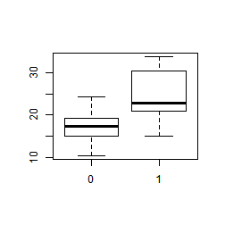
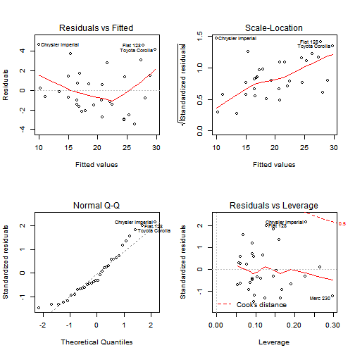

## The effect of transmission type to mileage in 1974 model cars
### Executive Summary
This report is aimed to determine the average effect of transmission type on mileage of various 1973 and 1974 make cars. These cars vary from luxury cars to sedan city cars and a total of 32 cars were investigated. The data has various variables such as number of cylinders, tansmission type, weight, etc.

The most parsimonious model with the highest coefficient of determination (R^2 = 83%) covered; weight, 1/4 mile time, and transmission type.

The analysis suggests a 2.93 mpg increase in mileage when changing the transmission type from automatic to manual; when weight and 1/4 mile time is kept constant. It should be noted that this regression is valid for the existing data points and extrapolation should be done with extreme caution.

In addition to the difference between two transmission types; the model suggests that lower mileage due to automatic transmission is partly due to increase in weight caused by the heavier system.

It is safe to say switching from automatic to manual transmission would have worked fine *regarding mileage* **in the year 1974**
### Exploratory Analysis
The variable names are printed a boplot of the mileage of two different transmission types. Finally the correlations of all the numeric variables to each other was investigated.
Note that most of the variables had to be redefined as factors (namely: *cyl*, *vs*, *am*, *gear* and *carb*

```r
names(mtcars)
cor(mtcars[sapply(mtcars, is.numeric)])
```

```
##  [1] "mpg"  "cyl"  "disp" "hp"   "drat" "wt"   "qsec" "vs"   "am"   "gear"
## [11] "carb"
```

```
##          mpg    disp      hp    drat      wt    qsec
## mpg   1.0000 -0.8476 -0.7762  0.6812 -0.8677  0.4187
## disp -0.8476  1.0000  0.7909 -0.7102  0.8880 -0.4337
## hp   -0.7762  0.7909  1.0000 -0.4488  0.6587 -0.7082
## drat  0.6812 -0.7102 -0.4488  1.0000 -0.7124  0.0912
## wt   -0.8677  0.8880  0.6587 -0.7124  1.0000 -0.1747
## qsec  0.4187 -0.4337 -0.7082  0.0912 -0.1747  1.0000
```
 

The correlation table shows that most of the numeric variables are considerably related to each other. We have to take this into account whan we are trying to find the most parsimonous model.

Also The boxplot strongly suggest a divide between two different transmission types. It seems we are on the right path.
### The Model

The strategy of determining the most relevent model was to maximise R^2 while minimizing the variables. The first comparison was made between a model that uses all the variables vs a model that only regressing using the transmission type.

```r
summary(lm(mpg ~ ., data = mtcars))$adj.r.squared
summary(lm(mpg ~ am, data = mtcars))$adj.r.squared
```

```
## [1] 0.779
```

```
## [1] 0.3385
```
Since all the variables give a higher R^2 it was decided to reduce the variables with the highest p values until R^2 stopped increasing.

The highest R^2 comes up when; power, weight and 1/4 mile time (qsec) are applied as covariates to thransmission type. However reducing hp does not impact the R^2 to much and the weight - power correlation is considerable (explained above). Thus the finel model has only the weight and qsec as covariates.

```r
summary(lm(mpg ~ . - cyl - gear - carb - vs - disp - drat, data = mtcars))$adj.r.squared
summary(lm(mpg ~ am + wt + qsec, data = mtcars))$adj.r.squared
summary(lm(mpg ~ am + wt + qsec, data = mtcars))$coefs
```

```
## [1] 0.8368
```

```
## [1] 0.8336
```

```
## NULL
```

This model shows that transmission type, weight and 1/4 mile time explaines 83% of the change of mileage in this data. Furthermore transmission type seems to change the mileage. In particular, with all covariates kept constant changing from automatic to manual increases the mileage 2.93 mpg in average.

### Diagnostics
When we plot rhe residual diagnostics we observe some outliers. Other than that the normality and independence of residuals are fairly comforting.

The major outliers are: **Chrysler Imperial**, **Fiat 128** and **Toyota Corolla**. Finally if we check the data for these cars we see:

```
##                    mpg cyl  disp  hp drat    wt  qsec vs am gear carb
## Chrysler Imperial 14.7   8 440.0 230 3.23 5.345 17.42  0  0    3    4
## Fiat 128          32.4   4  78.7  66 4.08 2.200 19.47  1  1    4    1
## Toyota Corolla    33.9   4  71.1  65 4.22 1.835 19.90  1  1    4    1
```
 


